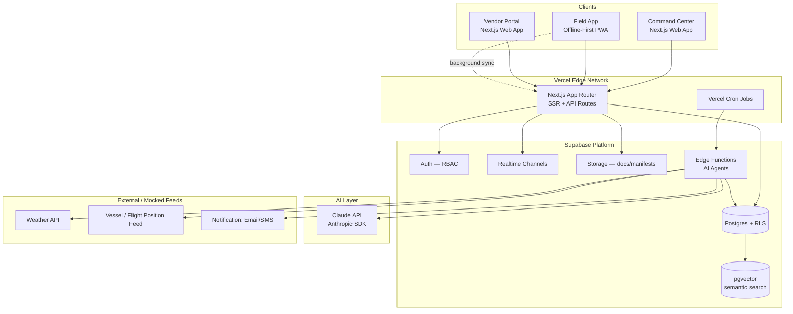

# POLARIS — Technical Requirements Document (TRD)
**SIH 2026 · PS 26062 · Integrated Polar Expedition Logistics and Asset Management System**

---

## 1. System Architecture Overview



**Design principle:** the browser/PWA clients never talk to Postgres directly except through Supabase's RLS-protected client SDK; all autonomous behaviour (forecasting, escalation, report drafting) lives in **scheduled Supabase Edge Functions / Vercel Cron jobs** that call the Claude API — this is the literal implementation of "runs while you sleep."

## 2. Technology Stack

| Layer | Choice | Why |
|---|---|---|
| Frontend framework | **Next.js 15 (App Router)**, TypeScript | SSR for the data-dense Command Center, static export capability for the Field PWA, one framework for all three portals |
| UI system | **Tailwind CSS + shadcn/ui + Radix primitives**, Framer Motion for micro-interactions | Fast to build an "elite" custom look without generic template feel; accessible primitives out of the box |
| Maps / geospatial | **MapLibre GL** (open-source, self-hostable tiles) or Mapbox GL | Voyage route, station digital twin, hazard-zone overlays |
| Charts | **Recharts / Tremor** | Consumption curves, cargo utilisation, risk dashboards |
| State/data fetching | **TanStack Query** + Supabase client | Caching, optimistic updates, realtime subscription glue |
| Backend / DB | **Supabase** (managed Postgres) | Postgres + Auth + Realtime + Storage + Edge Functions + pgvector in one platform, generous free tier, instant hackathon velocity |
| Auth & RBAC | Supabase Auth, custom `roles` table + **Row Level Security policies** | Three distinct portals need three distinct, provably-enforced permission boundaries — enforced at the database, not just the UI |
| Autonomous jobs | **Supabase Edge Functions** (Deno) scheduled via `pg_cron` / **Vercel Cron** | The "AI agents" — forecasting, escalation, report drafting — run headless on a schedule |
| AI | **Anthropic Claude API** (Claude Sonnet for reasoning/drafting, optionally Claude Haiku for fast classification tasks) | Natural-language copilot, autonomous drafting, anomaly explanation |
| Vector search | **pgvector** extension on Supabase Postgres | Semantic search over past expedition reports, SOPs, incident logs for the AI copilot's retrieval |
| Hosting | **Vercel** | Zero-config Next.js deploys, preview URLs per branch (perfect for showing "3–4 prototypes"), edge network, built-in cron |
| Notifications | **Resend** (email) + optional Twilio (SMS) | Vendor escalations, safety alerts |
| Offline sync (Field App) | **Service Worker + IndexedDB (Dexie.js)**, background sync queue reconciled against Supabase on reconnect | The one truly non-negotiable NFR — see §4 |
| Observability | **Vercel Analytics + Sentry** | Error tracking and performance, important for a "government-grade" pitch |
| Auth documents / files | Supabase Storage (signed URLs) | Cargo manifests, compliance certificates, training records |

## 3. Data Model (core entities)

```
organizations           -- NCPOR, vendors, ministry (multi-tenant boundary)
users                    -- linked to Supabase auth.users, role: admin | ops | field | vendor | leadership
stations                 -- Bharati, Maitri, Himadri (+ metadata: type, capacity, coordinates)
expeditions              -- e.g. "46-ISEA", station_id, season window (open/close dates), status
personnel                -- expedition_id, user_id, role, training_status, quarantine_status
travel_batches           -- personnel groupings, mode (sea/air), transit legs (Cape Town etc.)
vendors                  -- profile, category, performance_score
purchase_requisitions    -- expedition_id, requested_by, items[], status, deadline (packing cutoff)
purchase_orders          -- vendor_id, requisition_id, committed_delivery_date, status
cargo_items              -- PO/requisition link, weight, volume, category (consumable/spare/instrument)
shipments                -- mode (vessel/air/helicopter), route legs, ETA, current_position, status
inventory                -- station_id, item, quantity, unit, consumption_rate, reorder_threshold
consumption_logs         -- inventory_id, quantity_used, logged_at, logged_by
incidents                -- type (safety/medical/logistics), station_id, severity, status, timeline
checkins                 -- personnel_id, timestamp, geo (if available), hazard_zone_flag
hazard_zones             -- station_id, geometry, type (crevasse/wildlife/whiteout-risk)
weather_snapshots        -- station_id/route_id, source, forecast_window, risk_score
ai_agent_runs            -- agent_type, trigger, input_ref, output (draft/alert), status, reviewed_by
audit_log                -- actor, action, entity, before/after, timestamp (mandatory for gov data)
```

Every mutating table carries `created_by`, `created_at`, `updated_at`; RLS policies scope rows by `organization_id` and `role`, so a vendor can only ever see their own POs and a field user only their own station.

## 4. Non-Functional Requirements

| NFR | Requirement |
|---|---|
| **Offline resilience** | Field App must remain fully usable (view manifests, log consumption, check in) with zero connectivity; writes queue locally and sync with conflict resolution (last-write-wins + audit trail) when a link is available. This is the single hardest and most important NFR — treat it as a first-class architectural constraint, not an add-on. |
| **Low-bandwidth mode** | All station-facing views must degrade gracefully to text/number-only payloads under simulated satellite-link conditions (high latency, <64kbps). |
| **Security** | Supabase Auth + RLS on every table; encrypted at rest & in transit by default (Supabase/Vercel managed TLS); no client ever holds a service-role key. |
| **Auditability** | Every state change affecting cargo, inventory or personnel status is immutably logged (`audit_log`) — required for a government system. |
| **RBAC** | Four roles minimum (admin, ops, field, vendor); enforced at the RLS layer, not just hidden UI. |
| **Availability** | Vercel + Supabase managed infra gives strong default uptime; no self-managed servers to keep the hackathon build deployable in minutes. |
| **Accessibility** | WCAG 2.1 AA minimum — large touch targets and high-contrast mode specifically for the Field App (gloves, glare, low light). |
| **Scalability** | Multi-station, multi-expedition by design from day one (don't hardcode to 3 stations) so it generalizes to future stations/programmes. |
| **Data residency framing** | Note in the pitch that a production government deployment would use Supabase's self-hosted / dedicated / India-region options (or an on-prem Postgres) to satisfy government data-residency requirements — call this out explicitly to judges as a solved-for concern, not an oversight. |

## 5. AI Automation Architecture (the "sleep" layer)

| Agent | Trigger | Action |
|---|---|---|
| **Reorder Forecaster** | Nightly cron | Projects inventory depletion vs. days-to-next-window; auto-drafts a purchase requisition if projected to breach threshold |
| **Vendor Deadline Watcher** | Nightly cron + on PO update | Flags POs trending late against the *packing* cutoff (not just delivery date); drafts an escalation email via Claude for ops to approve/send |
| **Weather Contingency Planner** | On new weather snapshot ingestion | Compares forecast against voyage/flight schedule; if risk crosses threshold, generates a contingency brief with affected shipments and mitigation options |
| **Cargo Reconciliation** | On shipment "arrived" event | Diffs manifest vs. scanned-in items; flags shortfall/damage/mismatch |
| **Safety Escalation** | On missed check-in past hazard-aware threshold | Auto-raises an incident, notifies command center, suggests next SOP step |
| **Report Drafter** | Weekly cron / on demand | Assembles expedition status, cargo utilisation and safety summary into a ready-to-review MoES-style report |
| **Command Copilot** | On-demand chat (Command Center) | RAG over `ai_agent_runs`, `incidents`, past expedition reports (via pgvector) to answer natural-language planning questions |

All autonomous outputs are written as **drafts requiring human sign-off** by default (`ai_agent_runs.status = 'pending_review'`) — critical for a government pitch: the system acts *proactively* but never *unilaterally* on anything safety- or cost-critical. This is a deliberate, presentable design choice, not a limitation.

## 6. Deployment Plan

1. **Repo structure:** monorepo (Turborepo) — `apps/command-center`, `apps/field-pwa`, `apps/vendor-portal`, `packages/ui`, `packages/supabase-client`, `supabase/` (migrations + edge functions).
2. **Environments:** `dev` (local Supabase via CLI + `next dev`), `preview` (automatic Vercel preview URL per PR/branch — this is how the 3–4 prototype directions get their own shareable links), `production` (Vercel production + Supabase production project).
3. **CI/CD:** Vercel's native Git integration for the frontend; `supabase db push` / migration files versioned in-repo for the database; GitHub Actions to run typecheck/lint/tests on PR.
4. **Secrets:** Supabase URL/anon key (public, RLS-protected), `SUPABASE_SERVICE_ROLE_KEY` and `ANTHROPIC_API_KEY` stored only as Vercel encrypted environment variables, used only inside server-side routes and Edge Functions — never shipped to the client bundle.
5. **Seed data:** a realistic seed script (stations, one active expedition, sample vendors/POs/inventory) so the demo is populated the moment it deploys.

---
*See `03_POLARIS_Claude_Code_Handoff_Prompts.md` for the exact prompts to run this build end-to-end in Claude Code.*
